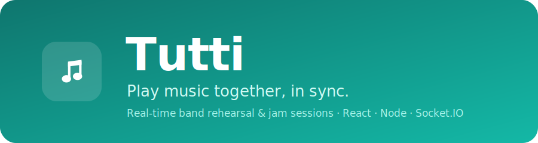
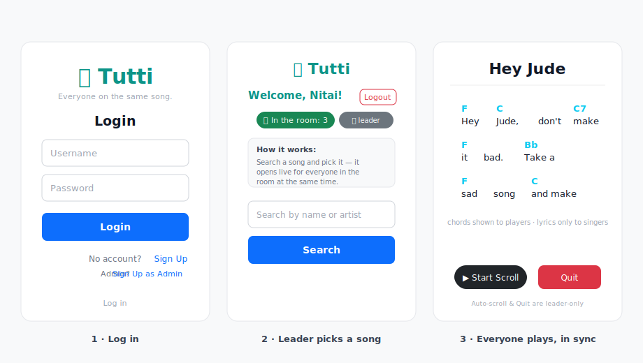

<p align="center">
  
</p>

<p align="center">
  <b>Tutti</b> is a real-time web app for band rehearsals and jam sessions. A session
  leader picks a song and it opens <i>live</i> on everyone's screen at once — chords for
  the players, lyrics-only for the singers.
  <br><br>
  🌐 <a href="https://jam-oveo.netlify.app/"><b>Live app</b></a>
</p>

> *Tutti* (Italian, "all together") is the musical direction for the whole ensemble to play at once — which is exactly what this app coordinates. *(Originally built as the "Moveo" rehearsal home assignment.)*

---

## Screens

<p align="center">
  
</p>

> The graphic above is a UI mockup of the three main screens. See the [live app](https://jam-oveo.netlify.app/) for the real thing.

## About

Musicians and singers log in from a laptop or phone and join one shared rehearsal room.
The **session leader** searches for a song and selects it; everyone in the room is taken
to the live view instantly. No refreshing — updates are pushed over WebSockets.

**Built with**

* **React + Vite + Bootstrap** — frontend (Netlify)
* **Node.js (Express)** — backend API (Render)
* **Socket.IO** — real-time song sync across all connected clients
* **PostgreSQL (Supabase)** — user accounts
* **JWT + bcrypt** — authentication

## How it works

1. Users sign up as a **player** (with an instrument) or a **session leader** (admin).
2. Everyone who logs in joins one shared room and sees a live count of who's in it.
3. The leader searches for a song and picks it — it opens **live for everyone at once**.
4. Players see **chords above the lyrics**; singers see **lyrics only**.
5. The leader controls **auto-scroll** and can **Quit** the song to bring everyone back.

## Security

* Passwords are hashed with **bcrypt**; login issues a signed **JWT**.
* Every **Socket.IO** connection is verified against that token server-side — connections
  with no/invalid token are rejected.
* The song-control events (`selectSong`, `quitRehearsal`) are authorized **on the server**
  from the verified identity, so only the real session leader can drive the room — a
  client can't gain control by faking an `isAdmin` flag locally.

## Run locally

You'll need the backend `.env` values (a PostgreSQL URI, e.g. Supabase, and a `JWT_SECRET`).

**Backend**

```bash
cd Backend
npm install
npm start
```

**Frontend**

```bash
cd Frontend
npm install
npm run dev      # opens http://localhost:5173
```

Point the frontend's `VITE_API_URL` at your backend (e.g. `http://localhost:3001`).

### Sign-up routes

* Player: `/signup`
* Session leader (admin): `/signup-admin`

---

Nitai Edelberg
