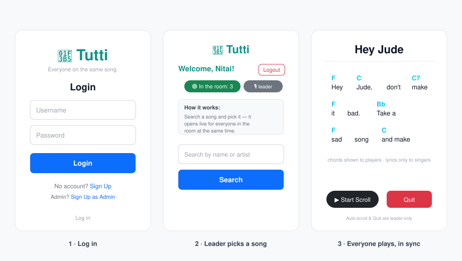

<p align="center">
  
</p>

<p align="center">
  <b>Tutti</b> is a real-time web app for band rehearsals and jam sessions. A session
  leader picks a song and it opens <i>live</i> on everyone's screen at once — chords for
  the players, lyrics-only for the singers.
  <br><br>
  🌐 <a href="https://jam-oveo.netlify.app/"><b>Live app</b></a>
</p>

> *Tutti* (Italian, "all together") is the musical direction for the whole ensemble to play at once — which is exactly what this app coordinates. *(Originally built as the "Moveo" rehearsal home assignment.)*

---

## Screens

<p align="center">
  
</p>

> The graphic above is a UI mockup of the three main screens. See the [live app](https://jam-oveo.netlify.app/) for the real thing.

## About

Musicians and singers log in from a laptop or phone and join one shared rehearsal room.
The **session leader** searches for a song and selects it; everyone in the room is taken
to the live view instantly. No refreshing — updates are pushed over WebSockets.

**Built with**

* **React + Vite + Bootstrap** — frontend (Netlify)
* **Node.js (Express)** — backend API (Render)
* **Socket.IO** — real-time song sync across all connected clients
* **PostgreSQL (Supabase)** — user accounts
* **JWT + bcrypt** — authentication

## How it works

1. Users sign up as a **player** (with an instrument) or a **session leader** (admin).
2. A leader hits **Start a session** and gets a short **room code** (e.g. `AB7K`) plus a
   shareable **invite link** (`/join/AB7K`). Players **enter the code** (or click the link)
   to join that specific room, so multiple bands can run separate sessions at once.
3. The leader browses the **song library right on the main page** (searchable by song or
   artist) and picks one — it opens **live for everyone in that room at once**.
4. Players see **chords above the lyrics**; singers see **lyrics only**. Hebrew songs
   render right-to-left automatically.
5. **Auto-scroll** is available to everyone with a **speed slider** for their own screen;
   the leader can toggle **"scroll everyone with me"** to drive the whole band in sync, and
   can **Quit** to bring everyone back.

### Song library

Songs live in `Backend/songs/*.json`. Each file carries its own metadata so search
and browse work by **title and artist**:

```json
{
  "title": "Let It Be",
  "artist": "The Beatles",
  "language": "en",
  "lines": [
    [ { "lyrics": "When", "chords": "C" }, { "lyrics": "I" }, { "lyrics": "find" } ]
  ]
}
```

`language` (`en`/`he`) drives the right-to-left layout, and each word can carry the
`chords` that sit above it. Legacy bare-array song files are still supported (the
title is derived from the file name). Drop in a new `.json` to add a song — no code
change needed.

**Adding songs quickly** — use the importer instead of hand-writing JSON. Put chords in
`[square brackets]` before the word they sit on (ChordPro style):

```
Title: Let It Be
Artist: The Beatles

[C]When I find myself in [G]times of trouble
[Am]Mother Mary [F]comes to me
```

```bash
node Backend/scripts/import_song.js song.txt   # writes Backend/songs/let_it_be.json
```

Language is auto-detected (Hebrew → right-to-left).

## Security

* Passwords are hashed with **bcrypt**; login issues a signed **JWT**.
* Every **Socket.IO** connection is verified against that token server-side — connections
  with no/invalid token are rejected.
* The song-control events (`selectSong`, `quitRehearsal`) are authorized **on the server**
  from the verified identity, so only the real session leader can drive the room — a
  client can't gain control by faking an `isAdmin` flag locally.

## Run locally

You'll need the backend `.env` values (a PostgreSQL URI, e.g. Supabase, and a `JWT_SECRET`).

**Backend**

```bash
cd Backend
npm install
npm start
```

**Frontend**

```bash
cd Frontend
npm install
npm run dev      # opens http://localhost:5173
```

Point the frontend's `VITE_API_URL` at your backend (e.g. `http://localhost:3001`).

### Tests

The backend has a test suite (Node's built-in runner) covering the real‑time room
logic — socket auth, creating/joining a room by code, the live‑song broadcast,
leader‑only controls, and scroll sync — plus the song API (search by title/artist,
browse‑all, fetch, path‑traversal guard):

```bash
cd Backend
npm install
npm test
```

### Sign-up routes

* Player: `/signup`
* Session leader (admin): `/signup-admin`

---

Nitai Edelberg
